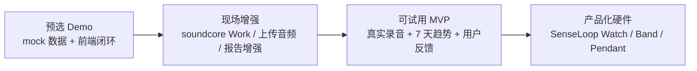

# Roadmap 路线图

## 目标

这份路线图用于说明 SenseLoop 不是一次性 Demo，而是一条可以从黑客松原型逐步走向产品化的路径。

核心路线：

```text
预选 Demo
  -> 现场增强版本
  -> 可试用 MVP
  -> SenseLoop Watch / Band / Pendant
```

每个阶段都围绕同一条主线展开：

```text
夜间声音 -> 身体信号理解 -> 晨间行动建议
```

## 阶段一：预选 Demo

### 阶段定位

用最稳定的方式证明产品体验闭环成立。

当前重点不是追求真实识别模型的准确率，而是让评委看到：

- 产品解决的是一个真实高频问题。
- soundcore Work 在核心链路里有明确角色。
- 前端已经能展示完整体验。
- 后台和数据结构已经为真实设备接入预留位置。

### 当前可交付

- React 前端 Demo。
- Python 后台骨架。
- 五类用户画像。
- 夜间声音事件 mock 数据。
- 每日身体信号 mock 数据。
- 本地规则引擎。
- 每日健康报告生成。
- 在线 Demo。
- PPT / PDF 答辩材料。
- Demo 二维码。

### 当前 Demo 重点展示

1. 选择用户画像。
2. 查看首页今日状态。
3. 查看 soundcore Work 夜间声音事件。
4. 查看饮食、排便、舌苔、口气等身体信号。
5. 生成当天饮食、运动、恢复和异常趋势建议。
6. 切换不同人群，展示日报重点变化。

### 本阶段技术策略

- 用 mock adapter 保证演示稳定。
- 用统一数据结构承接未来真实硬件。
- 用规则引擎保证建议边界可控。
- 用前端页面讲清楚产品体验。

### 本阶段评审价值

预选阶段要证明的不是“硬件已经量产”，而是：

> 这个想法有清晰场景、真实硬件入口、可运行原型和可继续开发的工程骨架。

## 阶段二：现场增强版本

### 阶段定位

在 24 小时现场开发中，把当前稳定 Demo 往真实设备和真实数据推进。

现场不推翻已有项目，而是在已跑通闭环上增强可信度。

### 优先增强目标

1. 接入 soundcore Work SDK 或真实录音文件。
2. 增加音频上传入口。
3. 将真实录音或重点标记转换成 `SleepAudioEvent`。
4. 在睡眠页展示真实/上传来源。
5. 在日报页体现真实声音事件对建议的影响。
6. 优化报告文案，让建议更自然、更像用户第二天能执行的计划。

### 可选增强目标

- 接入 LLM adapter，负责日报文案润色。
- 增加图片上传入口，用于饮食和舌苔模拟识别。
- 如 eufy 能力可用，接入非隐私视觉事件。
- 增加“数据来源”标签：mock、upload、soundcore_sdk、eufy。
- 增加演示路径：减脂用户、老人、上班族。

### 现场 fallback 方案

| 风险 | 备用方案 |
| --- | --- |
| soundcore Work SDK 不可用 | 使用上传录音或预置音频事件 |
| 音频识别来不及 | 使用人工标注或半自动标签 |
| API Key 不可用 | 使用本地规则引擎和模板文案 |
| 网络不稳定 | 前端和零依赖 Python 后台本地运行 |
| eufy 接入来不及 | 保留为非隐私视觉扩展说明 |
| 时间不足 | 保首页、睡眠页、日报页三页闭环 |

### 本阶段评审价值

现场版本要让评委看到：

> 这个项目不是只会讲概念，团队可以在已有工程骨架上接真实设备、处理真实输入，并保持演示稳定。

## 阶段三：可试用 MVP

### 阶段定位

从比赛 Demo 走向小范围用户试用。

这个阶段的重点是让真实用户愿意连续使用，而不是只在现场演示一次。

### MVP 用户范围

优先聚焦三类人群：

- 减脂人群。
- 上班族 / 熬夜人群。
- 老年人家庭关怀场景。

学生和长期失眠人群可以保留为扩展画像，等核心闭环稳定后再深入。

### MVP 核心能力

- 真实录音或上传音频生成夜间声音事件。
- 用户画像与睡前/醒后反馈。
- 饮食、排便、舌苔、口气的主动记录。
- 每日行动建议。
- 连续 7 天趋势观察。
- 隐私设置和数据删除。
- 家庭共享摘要，可选开启。

### MVP 技术重点

- 音频事件识别准确率提升。
- 用户反馈修正机制。
- 规则引擎和 LLM 文案生成结合。
- 数据存储和历史趋势。
- 敏感数据本地优先处理。
- 报告建议边界审核。

### MVP 验证指标

- 用户是否愿意连续 7 天打开晨间报告。
- 用户是否理解“今天怎么吃、怎么动、怎么恢复”。
- 用户是否愿意修正饮食和身体信号标签。
- 用户是否信任隐私设计。
- 不同画像下建议是否有明显差异。

### 本阶段产品价值

可试用 MVP 要证明：

> SenseLoop 不只是一个好看的黑客松页面，而是有机会形成每日使用习惯的健康助手。

## 阶段四：产品化版本

### 阶段定位

把 soundcore Work 原型验证出来的能力，迁移到 SenseLoop 专用健康穿戴硬件。

未来形态：

- SenseLoop Watch。
- SenseLoop Band。
- SenseLoop Pendant。

### 硬件演进方向

| 产品形态 | 核心能力 | 适合场景 |
| --- | --- | --- |
| SenseLoop Watch | 声音、心率、血氧、运动、屏幕交互 | 健康管理、运动恢复、日常日报 |
| SenseLoop Band | 声音、心率、运动、长续航 | 睡眠观察、轻量穿戴、低打扰记录 |
| SenseLoop Pendant | 近身声音、口气/状态传感、轻交互 | 老人关怀、失眠人群、低操作门槛 |

### 产品化能力扩展

- 端侧夜间声音识别。
- 心率、脉搏、血氧、运动数据融合。
- 饮食拍照和 kcal 区间估算。
- 舌苔拍照和趋势标签。
- 排便状态主动记录。
- 口气/VOC 传感器探索。
- 家庭健康日报。
- 长期趋势和异常提醒。

### 商业化路径

1. **硬件销售**：Watch / Band / Pendant。
2. **App 订阅**：高级日报、长期趋势、个性化建议。
3. **家庭健康服务**：老人摘要、家人同步、连续异常提醒。
4. **健康服务合作**：营养、运动、睡眠改善服务。

### 产品边界

- 不做医疗诊断。
- 不替代医生。
- 不自动拍摄隐私内容。
- 不以疾病名称吓唬用户。
- 只做趋势观察、异常提醒、生活方式建议和就医提示。

### 本阶段评审价值

产品化版本要说明：

> 当前用 soundcore Work 验证声音入口，未来可以自然扩展成 Anker 在健康穿戴方向的新产品线。

## 总体路线图



## 阶段能力对照表

| 能力 | 预选 Demo | 现场增强 | 可试用 MVP | 产品化版本 |
| --- | --- | --- | --- | --- |
| 夜间声音事件 | mock 数据 | SDK 或上传音频 | 真实音频识别 | 端侧识别 |
| 用户画像 | 已支持五类 | 优化演示路径 | 用户长期画像 | 设备长期学习 |
| 每日报告 | 已生成 | 文案增强 | 连续趋势 | 个性化订阅服务 |
| 饮食记录 | mock / 页面展示 | 图片上传入口 | 用户修正 kcal | 视觉模型 + 用户修正 |
| 排便记录 | 手动标签 | 手动标签增强 | 趋势观察 | 端侧标签优先 |
| 舌苔/口气 | 概念模块 | 上传/反馈入口 | 标签趋势 | 摄像头/传感器探索 |
| eufy 扩展 | placeholder | 可选接入 | 非隐私视觉事件 | 家庭健康场景 |
| 隐私边界 | 已说明 | 现场强化 | 设置与删除 | 端侧优先 |

## 一句话总结

SenseLoop 的路线不是先做一个完整手表，而是先用 soundcore Work 验证夜间声音健康洞察，再把这个闭环扩展到可试用 App，最后演进为 Watch / Band / Pendant 健康穿戴产品线。
