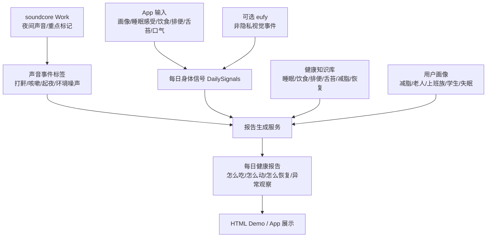
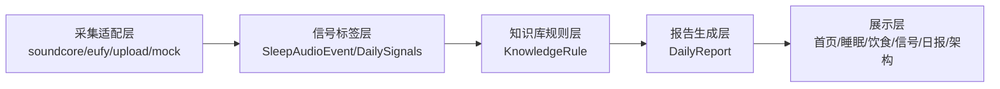
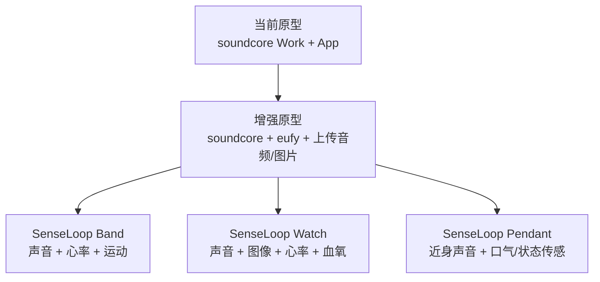

# 系统架构图

## 当前原型架构

```mermaid
flowchart TD
  A["soundcore Work\n夜间声音/重点标记"] --> B["声音事件标签\n打鼾/咳嗽/起夜/环境噪声"]
  C["App 输入\n画像/睡眠感受/饮食/排便/舌苔/口气"] --> D["每日身体信号 DailySignals"]
  E["可选 eufy\n非隐私视觉事件"] --> D
  B --> F["报告生成服务"]
  D --> F
  G["健康知识库\n睡眠/饮食/排便/舌苔/减脂/恢复"] --> F
  H["用户画像\n减脂/老人/上班族/学生/失眠"] --> F
  F --> I["每日健康报告\n怎么吃/怎么动/怎么恢复/异常观察"]
  I --> J["HTML Demo / App 展示"]
```

## 工程分层

```mermaid
flowchart LR
  A["采集适配层\nsoundcore/eufy/upload/mock"] --> B["信号标签层\nSleepAudioEvent/DailySignals"]
  B --> C["知识库规则层\nKnowledgeRule"]
  C --> D["报告生成层\nDailyReport"]
  D --> E["展示层\n首页/睡眠/饮食/信号/日报/架构"]
```

## 未来硬件演进

```mermaid
flowchart TD
  A["当前原型\nsoundcore Work + App"] --> B["增强原型\nsoundcore + eufy + 上传音频/图片"]
  B --> C["SenseLoop Band\n声音 + 心率 + 运动"]
  B --> D["SenseLoop Watch\n声音 + 图像 + 心率 + 血氧"]
  B --> E["SenseLoop Pendant\n近身声音 + 口气/状态传感"]
```
