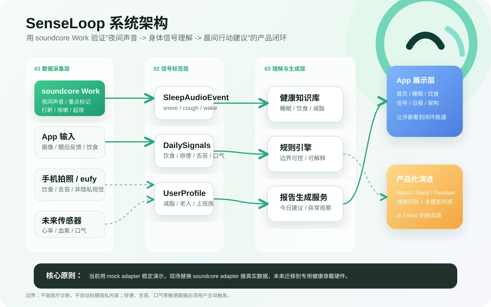

# 系统架构图

这张图用于放入预选提交材料、PPT、README 或演示视频中，目标是让评委一眼看懂 SenseLoop 的整体架构：

```text
Anker 硬件入口
  -> 多模态身体信号
  -> 健康知识库与规则引擎
  -> 晨间行动建议
  -> 未来健康穿戴产品化
```

## 单图版本



文件路径：

```text
docs/submission-preselection/diagrams/senseloop-system-architecture.svg
docs/submission-preselection/diagrams/senseloop-system-architecture.png
```

使用建议：

- README 或 Markdown 文档中优先使用 SVG，放大不失真。
- PPT、视频剪辑、提交平台附件中优先使用 PNG，兼容性更好。

## 架构说明

### 1. 数据采集层

- **soundcore Work**：当前主硬件入口，用于夜间声音、重点标记、打鼾、咳嗽、起夜、环境噪声。
- **App 输入**：用户画像、醒后反馈、饮食、排便、舌苔、口气等主动记录。
- **手机拍照 / eufy**：饮食、舌苔、非隐私视觉观察。
- **未来传感器**：心率、血氧、脉搏、口气/VOC 等穿戴能力。

### 2. 信号标签层

把不同来源的数据统一成结构化标签：

- `SleepAudioEvent`
- `DailySignals`
- `UserProfile`

页面和报告生成层不直接依赖某一个 SDK。现场如果拿到 soundcore Work SDK，只需要替换 adapter，不需要推翻整体架构。

### 3. 理解与生成层

核心由三部分组成：

- 健康知识库：睡眠、饮食、减脂、排便、舌苔、恢复建议。
- 规则引擎：保证建议边界可控、可解释。
- 报告生成服务：生成“怎么吃、怎么动、怎么恢复、哪些异常需要观察”。

### 4. 展示层

当前 Demo 包含：

- 首页。
- 睡眠页。
- 饮食页。
- 信号页。
- 日报页。
- 架构页。

### 5. 产品化演进

当前使用 soundcore Work 跑通夜间声音闭环；未来可以迁移到：

- SenseLoop Watch。
- SenseLoop Band。
- SenseLoop Pendant。

## 核心表达

SenseLoop 的技术路线不是一次性 Demo，而是：

```text
mock adapter 稳定演示
  -> soundcore adapter 接真实数据
  -> 多模态健康信号融合
  -> 专用健康穿戴硬件
```

## 边界

- 不做医疗诊断。
- 不承诺治疗疾病。
- 不自动拍摄隐私内容。
- 排便、舌苔、口气等敏感数据必须用户主动触发。
- 当前 Demo 优先验证夜间声音到晨间建议的核心闭环。
